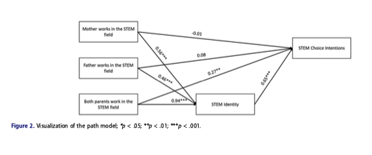

# Model specification

* Which variables are included in the model
* Which variables are related to which 
* How are variables related to each other
* Based on the relationships, what is the model-implied covariance? 

# Agenda

- Paper Discussion
- Terminology
- Systems of Equations as Path Diagrams
- Model-implied covariance
- Mini Project 1 
- R/lavaan gui


# Paper Discussion

- Theoretical motivation for the variables in the model? 
- Theoretical motivation for the relationships between variables in the model?
- Were any variables left out? 

# Terminology

## Measured vs. latent variables

**Measured** (**observed**) variables are recorded directly in the data.

- Ex: **reading score**, **books at home**, **parent education**.

::: {.fragment}
**Latent** variables are *not* observed directly 
  
  - they are inferred from patterns among measured variables
  - typically not easily captured by a single variable

- Ex: **academic performance**, **intelligence**, **problem-solving ability**.
:::


::: {.content-visible when-profile="teacher"}
::: {.notes}
"Measured" and "observed" For this unit, measured. Later, we'll get into latent variables
:::
:::

## Review

- Input/independent variables & output/dependent variables

## Exogenous vs. endogenous variables

- **Exogenous variables:** nothing in the model explains it, but it explains other things.

::: {.fragment}
- **Endogenous variables:** are explained by another variable in the model. 
:::

::: {.fragment}
$$\text{Books} = a_0 + a_1(\text{ParentEd}) + \zeta_B$$
$$\text{Reading} = b_0 + b_1(\text{Books}) + \zeta_R$$
:::

## Review

Residuals:

::: {.content-visible when-profile="teacher"}
::: {.fragment}
difference between an observed value and the value your model predicts
:::
:::

## Disturbance

* Case-level: Actual value of the endogenous variable minus what's predicted by whatever the model says explains it

* Model level: Var(disturbance) the part of an endogenous variable's variance that isn't explained by the model

* **Exogenous** variables have no disturbance — nothing in the model predicts them.

In our example, books at home and reading score each get a disturbance; parent education does not.

::: {.content-visible when-profile="teacher"}
::: {.notes}
$\zeta_B$ = everything besides parent education driving books at home;
$\zeta_R$ = everything besides books at home driving reading. Same idea as a
regression residual. 

As in Week 2, we assume the disturbance is uncorrelated with the predictors: cov(ParentEd, ζ_B) = 0.
:::
:::

## Review

**Parameters** are the quantities the model estimates: 

* What parameters do we estimate in a regression model? 

::: {.content-visible when-profile="teacher"}
::: {.fragment}
slope, intercept, error
:::
:::

## SEM Parameters

**Parameters** are the quantities the model estimates: 

* path coefficients, 
* variances of exogenous variables, 
* disturbance of endogenous variables, 
* Covariances among exogenous variables

## SEM Parameters p2

In our example, the **path coefficients** are parameters the model estimates:

$$\text{Books} = \color{#C81E7A}{a_0} + \color{#C81E7A}{a_1}(\text{ParentEd}) + \color{#C81E7A}{\zeta_B}$$
$$\text{Reading} = \color{#C81E7A}{b_0} + \color{#C81E7A}{b_1}(\text{Books}) + \color{#C81E7A}{\zeta_R}$$

## Pause & Recap

Contrast these terms from regression and their counterparts in SEM

1. Input/Output (dependent/independent) vs exogenous/endogenous
2. Residuals vs disturbance

## Pause & Recap 2

1. What are parameters we estimate in regression? 
2. What about in SEM?

## Systems of Equations as Diagrams

Same model, two representations — matching colors show what maps to what.

:::: {.columns}

::: {.column width="46%"}
::: {style="font-size: 0.82em"}
$$\text{Books} = a_0 + \color{#E07B1A}{a_1}\,\text{ParentEd} + \color{#C81E7A}{\zeta_B}$$

$$\text{Reading} = b_0 + \color{#2C6FB5}{b_1}\,\text{Books} + \color{#6FA80F}{\zeta_R}$$
:::
:::

::: {.column width="54%"}
```{r}
#| echo: false
#| fig-width: 6.5
#| fig-height: 4.8
library(ggplot2)

oNG <- "#E07B1A"; BLU <- "#2C6FB5"; MAG <- "#C81E7A"; LIM <- "#6FA80F"; dk <- "#3A3A3A"
ar <- grid::arrow(length = grid::unit(0.22, "cm"), type = "closed")
ar2 <- grid::arrow(length = grid::unit(0.18, "cm"), ends = "both", type = "closed")

circle <- function(x, y, r = 0.5) {
  t <- seq(0, 2 * pi, length.out = 60)
  data.frame(x = x + r * cos(t), y = y + r * sin(t))
}
box <- function(x, label) list(
  annotate("rect", xmin = x - 1.15, xmax = x + 1.15, ymin = -0.55, ymax = 0.55, fill = dk),
  annotate("text", x = x, y = 0, label = label, colour = "white", size = 5, lineheight = 0.9)
)

ggplot() +
  # path a1: ParentEd -> Books (orange)
  annotate("segment", x = 1.15, xend = 2.85, y = 0, yend = 0, colour = oNG, linewidth = 1.3, arrow = ar) +
  annotate("text", x = 2, y = 0.45, label = "a[1]", parse = TRUE, colour = oNG, size = 6, fontface = "italic") +
  # path b1: Books -> Reading (blue)
  annotate("segment", x = 5.15, xend = 6.85, y = 0, yend = 0, colour = BLU, linewidth = 1.3, arrow = ar) +
  annotate("text", x = 6, y = 0.45, label = "b[1]", parse = TRUE, colour = BLU, size = 6, fontface = "italic") +
  # variance of exogenous Parent education (self-loop)
  annotate("curve", x = -0.55, y = 0.6, xend = 0.55, yend = 0.6,
           colour = dk, linewidth = 0.9, curvature = -1.4, arrow = ar2) +
  annotate("text", x = 0, y = 1.85, label = "Var", colour = dk, size = 4.6, fontface = "italic") +
  # disturbance zeta_B on Books (magenta)
  annotate("segment", x = 4, xend = 4, y = 1.85, yend = 0.6, colour = MAG, arrow = ar) +
  annotate("text", x = 4, y = 2.25, label = "zeta[B]", parse = TRUE, colour = MAG, size = 4.6) +
  # disturbance zeta_R on Reading (lime)
  annotate("segment", x = 8, xend = 8, y = 1.85, yend = 0.6, colour = LIM, arrow = ar) +
  annotate("text", x = 8, y = 2.25, label = "zeta[R]", parse = TRUE, colour = LIM, size = 4.6) +
  # measured variables
  box(0, "Parent\neducation") + box(4, "Books at\nhome") + box(8, "Reading\nscore") +
  coord_equal(clip = "off") +
  expand_limits(x = c(-1.3, 9.3), y = c(-0.9, 3)) +
  theme_void()
```
:::

::::


## Key rules for Diagrams

* Measured Variables: rectangles/squares
* Latent Variables: Ovals/circles
* Path Coefficients: Straight, single-headed arrows from predictor to predicted (theory-driven)
* Disturbance: Arrow from Disturbance pointing to the endogenous variable (mandatory)
* Covariance: Curved, double-headed arrow (between two exogenous variables)

## Examples

Read each of the following models. For each, answer the same three questions.

1. What relationships does it predict? 
2. Which variables are Exogenous vs. endogenous? 
3. What parameters does it estimate? 


```{r}
#| include: false
library(ggplot2)

dk <- "#3A3A3A"; MAG <- "#C81E7A"; ORG <- "#E07B1A"; GRY <- "#9AA0A6"
AR  <- grid::arrow(length = grid::unit(0.20, "cm"), type = "closed")
AR2 <- grid::arrow(length = grid::unit(0.16, "cm"), ends = "both", type = "closed")

ecirc <- function(x, y, r = 0.45) {
  t <- seq(0, 2 * pi, length.out = 60)
  data.frame(x = x + r * cos(t), y = y + r * sin(t))
}
node <- function(x, y, label, w = 2.6, h = 1.1) list(
  annotate("rect", xmin = x - w/2, xmax = x + w/2, ymin = y - h/2, ymax = y + h/2, fill = dk),
  annotate("text", x = x, y = y, label = label, colour = "white", size = 4.5, lineheight = 0.9)
)
path <- function(x1, y1, x2, y2) annotate("segment", x = x1, y = y1, xend = x2, yend = y2,
                                          colour = MAG, linewidth = 1.2, arrow = AR)
plab <- function(x, y, label) annotate("text", x = x, y = y, label = label, parse = TRUE,
                                       colour = MAG, size = 4.6, fontface = "italic")
dist <- function(x, ycirc, ytarget, label) list(
  annotate("segment", x = x, y = ycirc - 0.45, xend = x, yend = ytarget, colour = GRY, arrow = AR),
  annotate("text", x = x, y = ycirc + 0.05, label = label, parse = TRUE, colour = GRY, size = 3.8)
)
canvas <- list(coord_equal(clip = "off"), theme_void())
```

## Example 1

::: {style="font-size: 0.85em"}
$$\text{Motivation} = a_0 + a_1(\text{Support}) + \zeta_M$$
$$\text{Grades} = b_0 + b_1(\text{Motivation}) + \zeta_G$$
:::

```{r}
#| echo: false
#| fig-width: 8
#| fig-height: 2.4
ggplot() +
  path(1.3, 0, 2.7, 0) +
  path(5.3, 0, 6.7, 0) +
  plab(2, 0.4, "a[1]") +
  plab(6, 0.4, "b[1]") +
  dist(4, 2.0, 0.6, "zeta[M]") +
  dist(8, 2.0, 0.6, "zeta[G]") +
  node(0, 0, "Teacher\nsupport") +
  node(4, 0, "Academic\nmotivation") +
  node(8, 0, "Course\ngrades") +
  canvas +
  expand_limits(x = c(-1.5, 9.5), y = c(-0.7, 2.6))
```

::: {.content-visible when-profile="teacher"}
::: {.notes}
Exogenous: teacher support. Endogenous: motivation, grades. Parameters: 2
paths, var(teacher support), 2 disturbance variances. Ask: is "motivation"
measured (a scale score → rectangle) or latent (a construct → oval)?
:::
:::

## Example 2

::: {style="font-size: 0.8em"}
$$\text{Engagement} = a_0 + a_1(\text{Involvement}) + a_2(\text{SES}) + \zeta_E$$
$$\text{Homework} = b_0 + b_1(\text{Engagement}) + \zeta_H$$
$$\text{Grade} = c_0 + c_1(\text{Homework}) + \zeta_G$$
:::

```{r}
#| echo: false
#| fig-width: 9.5
#| fig-height: 3.0
ggplot() +
  annotate("curve", x = -1.4, y = 1.1, xend = -1.4, yend = -1.1,
           colour = ORG, linewidth = 1, curvature = 0.6, arrow = AR2) +
  annotate("text", x = -2.7, y = 0, label = "cov", colour = ORG, size = 3.8, fontface = "italic") +
  path(1.4, 1.35, 2.4, 0.35) +
  path(1.4, -1.35, 2.4, -0.35) +
  path(5.2, 0, 6.2, 0) +
  path(9.0, 0, 10.0, 0) +
  plab(2.05, 1.05, "a[1]") +
  plab(2.05, -1.05, "a[2]") +
  plab(5.7, 0.4, "b[1]") +
  plab(9.5, 0.4, "c[1]") +
  dist(3.8, 2.0, 0.6, "zeta[E]") +
  dist(7.6, 2.0, 0.6, "zeta[H]") +
  dist(11.4, 2.0, 0.6, "zeta[G]") +
  node(0, 1.7, "Parental\ninvolvement", w = 2.8) +
  node(0, -1.7, "SES", w = 2.8) +
  node(3.8, 0, "Student\nengagement", w = 2.8) +
  node(7.6, 0, "Homework\ncompletion", w = 2.8) +
  node(11.4, 0, "Final\ngrade", w = 2.8) +
  canvas +
  expand_limits(x = c(-3.2, 12.9), y = c(-2.5, 2.6))
```

::: {.content-visible when-profile="teacher"}
::: {.notes}
Exogenous: parental involvement, SES (correlated → the curved covariance
arrow). Endogenous: engagement, homework completion, final grade. Parameters:
4 paths, 2 exogenous variances, 1 covariance, 3 disturbance variances.
:::
:::

## Example 3



# Model Implied Covariance


## Model-implied covariance matrix

- Model-implied covariance is determined by tracing rules
- Tracing rules are derived algebraically. 


## Review

- Why do we need the model-implied covariance matrix? 
- Conceptually, how do we minimize distance between the observed & model-predicted matrices? 

Key concepts: maximum likelihood function, gradient descent, update rule

## Getting Model-implied cov

First identify the paths using tracing rules: 

1. A route may go backward against an arrowhead, then forward with an arrowhead — but never forward-then-backward. 
4. Never pass through the same variable twice in one route (no loops).
3. A route may pass through at most one curved double-headed (covariance) arrow, and only at the route's turning point.

## Getting model-implied covariance 2

Then get the covariance using the paths

1. Find every valid route between the two variables (following the rules above).
2. For each route, multiply together all the path coefficients (and the one correlation/covariance term, if a curved arrow is involved).
3. Multiply the whole product by the variance of the route's ultimate common source variable.
4. Sum the contributions across all valid routes — that sum equals the total covariance between the two variables.


## Example: Books as a mediator

The model in two forms — we'll build its **model-implied covariance matrix** one cell at a time by *tracing*.

$$\text{Books} = a_0 + a_1\,\text{ParentEd} + \zeta_B \qquad \text{Reading} = b_0 + b_1\,\text{Books} + \zeta_R$$

*P = Parent ed · B = Books · R = Reading*

```{r}
#| include: false
library(ggplot2)

## one colour per matrix cell
c_pp <- "#128A7D"; c_pb <- "#E07B1A"; c_bb <- "#C81E7A"
c_pr <- "#2C6FB5"; c_br <- "#7A3FA0"; c_rr <- "#6FA80F"
BASE <- "#BFC3C7"; DK <- "#3A3A3A"

AR <- grid::arrow(length = grid::unit(0.18, "cm"), type = "closed")
AR2 <- grid::arrow(length = grid::unit(0.14, "cm"), ends = "both", type = "closed")

# Var(ParentEd) self-loop, below the ParentEd box
p_varloop <- function(col, lty, lwd) annotate("curve", x = -0.5, y = -0.55, xend = 0.5, yend = -0.55,
                                              curvature = 0.9, colour = col, linewidth = lwd,
                                              linetype = lty, arrow = AR2)

ecirc <- function(x, y, r = 0.5) {
  t <- seq(0, 2 * pi, length.out = 60)
  data.frame(x = x + r * cos(t), y = y + r * sin(t))
}
nodebox <- function(x, label) list(
  annotate("rect", xmin = x - 1.15, xmax = x + 1.15, ymin = -0.55, ymax = 0.55, fill = DK),
  annotate("text", x = x, y = 0, label = label, colour = "white", size = 4.4, lineheight = 0.9)
)
base_model <- function() list(
  annotate("segment", x = 1.15, xend = 2.85, y = 0, yend = 0, colour = BASE, linewidth = 1, arrow = AR),
  annotate("segment", x = 5.15, xend = 6.85, y = 0, yend = 0, colour = BASE, linewidth = 1, arrow = AR),
  annotate("text", x = 2, y = 0.4, label = "a[1]", parse = TRUE, colour = BASE, size = 4.2),
  annotate("text", x = 6, y = 0.4, label = "b[1]", parse = TRUE, colour = BASE, size = 4.2),
  annotate("segment", x = 4, xend = 4, y = 1.8, yend = 0.6, colour = BASE, arrow = AR),
  annotate("segment", x = 8, xend = 8, y = 1.8, yend = 0.6, colour = BASE, arrow = AR),
  annotate("text", x = 4, y = 2.3, label = "zeta[B]", parse = TRUE, colour = BASE, size = 3.6),
  annotate("text", x = 8, y = 2.3, label = "zeta[R]", parse = TRUE, colour = BASE, size = 3.6),
  p_varloop(BASE, "solid", 0.9),
  annotate("text", x = 0, y = -1.5, label = "Var(P)", colour = BASE, size = 3.4),
  nodebox(0, "Parent\neducation"), nodebox(4, "Books at\nhome"), nodebox(8, "Reading\nscore")
)
trace_edge <- function(e, col) annotate("segment", x = e[1], y = e[2], xend = e[3], yend = e[4],
                                        colour = col, linewidth = 1.7, linetype = "dotted", arrow = AR)
NODEPOS <- list(P = c(0, 0), B = c(4, 0), R = c(8, 0), zB = c(4, 2.3), zR = c(8, 2.3))
node_hi <- function(key, col) {
  if (key == "P") return(p_varloop(col, "dotted", 1.7))
  p <- NODEPOS[[key]]
  if (key %in% c("B", "R")) {
    annotate("rect", xmin = p[1] - 1.28, xmax = p[1] + 1.28, ymin = -0.68, ymax = 0.68,
             fill = NA, colour = col, linewidth = 1.3, linetype = "dotted")
  } else {
    # disturbance node: its arrow is already highlighted via trace_edge, no ring (no circles on disturbances)
    NULL
  }
}

STEPS <- list(
  list(cells = list(c(1,1)), expr = "Var(P)", col = c_pp, edges = list(), hi = c("P")),
  list(cells = list(c(1,2), c(2,1)), expr = "a[1] %.% Var(P)", col = c_pb,
       edges = list(c(1.15,0,2.85,0)), hi = c("P")),
  list(cells = list(c(2,2)), expr = "atop(a[1]^2 %.% Var(P), +~Var(zeta[B]))", col = c_bb,
       edges = list(c(1.15,0,2.85,0), c(4,1.8,4,0.6)), hi = c("P","zB")),
  list(cells = list(c(1,3), c(3,1)), expr = "a[1] %.% b[1] %.% Var(P)", col = c_pr,
       edges = list(c(1.15,0,2.85,0), c(5.15,0,6.85,0)), hi = c("P")),
  list(cells = list(c(2,3), c(3,2)), expr = "b[1] %.% Var(B)", col = c_br,
       edges = list(c(5.15,0,6.85,0)), hi = c("B")),
  list(cells = list(c(3,3)), expr = "atop(b[1]^2 %.% Var(B), +~Var(zeta[R]))", col = c_rr,
       edges = list(c(5.15,0,6.85,0), c(8,1.8,8,0.6)), hi = c("B","zR"))
)

diagram <- function(i) {
  st <- STEPS[[i]]
  g <- ggplot() + base_model()
  for (e in st$edges) g <- g + trace_edge(e, st$col)
  for (h in st$hi) g <- g + node_hi(h, st$col)
  g + coord_equal(clip = "off") + theme_void() +
    expand_limits(x = c(-1.5, 9.5), y = c(-1.7, 3.1))
}

covmat <- function(i) {
  labs <- c("P", "B", "R")
  g <- ggplot()
  for (r in 1:3) for (cc in 1:3) {
    g <- g + annotate("rect", xmin = cc - 0.48, xmax = cc + 0.48,
                      ymin = (4 - r) - 0.48, ymax = (4 - r) + 0.48,
                      fill = "grey95", colour = "grey80")
  }
  for (s in seq_len(i)) {
    st <- STEPS[[s]]; emph <- (s == i)
    for (cell in st$cells) {
      rr <- cell[1]; ccx <- cell[2]
      g <- g +
        annotate("rect", xmin = ccx - 0.48, xmax = ccx + 0.48,
                 ymin = (4 - rr) - 0.48, ymax = (4 - rr) + 0.48,
                 fill = st$col, alpha = if (emph) 0.92 else 0.32,
                 colour = if (emph) "black" else NA, linewidth = if (emph) 1 else 0) +
        annotate("text", x = ccx, y = (4 - rr), label = st$expr, parse = TRUE,
                 colour = if (emph) "white" else "grey25", size = 3.1, lineheight = 0.9)
    }
  }
  for (k in 1:3) {
    g <- g + annotate("text", x = k, y = 3.72, label = labs[k], fontface = "bold", size = 4.2) +
      annotate("text", x = 0.32, y = 4 - k, label = labs[k], fontface = "bold", size = 4.2)
  }
  g + coord_equal(clip = "off") + theme_void() +
    expand_limits(x = c(0.1, 3.6), y = c(0.4, 4.0))
}
```

## Trace 1 — Var(Parent ed)

:::: {.columns}
::: {.column width="56%"}
```{r}
#| echo: false
#| fig-width: 6
#| fig-height: 3.4
diagram(1)
```
:::
::: {.column width="44%"}
```{r}
#| echo: false
#| fig-width: 4.4
#| fig-height: 4.4
covmat(1)
```
:::
::::

**Var(P):** ParentEd is exogenous — its variance is a free parameter. Nothing to trace.

## Trace 2 — Cov(Parent ed, Books)

:::: {.columns}
::: {.column width="56%"}
```{r}
#| echo: false
#| fig-width: 6
#| fig-height: 3.4
diagram(2)
```
:::
::: {.column width="44%"}
```{r}
#| echo: false
#| fig-width: 4.4
#| fig-height: 4.4
covmat(2)
```
:::
::::

**Cov(P, B):** one route P→B (rule 1). Multiply the coefficient a₁ (rule 5), then × the variance at the top, Var(P).

## Trace 3 — Var(Books)

:::: {.columns}
::: {.column width="56%"}
```{r}
#| echo: false
#| fig-width: 6
#| fig-height: 3.4
diagram(3)
```
:::
::: {.column width="44%"}
```{r}
#| echo: false
#| fig-width: 4.4
#| fig-height: 4.4
covmat(3)
```
:::
::::

**Var(B):** trace B to itself. Up-and-back through the common cause P → a₁²·Var(P); plus its own disturbance → Var(ζ_B). Sum the routes (rule 6).

## Trace 4 — Cov(Parent ed, Reading)

:::: {.columns}
::: {.column width="56%"}
```{r}
#| echo: false
#| fig-width: 6
#| fig-height: 3.4
diagram(4)
```
:::
::: {.column width="44%"}
```{r}
#| echo: false
#| fig-width: 4.4
#| fig-height: 4.4
covmat(4)
```
:::
::::

**Cov(P, R):** one route P→B→R. Multiply a₁·b₁, then × Var(P).

## Trace 5 — Cov(Books, Reading)

:::: {.columns}
::: {.column width="56%"}
```{r}
#| echo: false
#| fig-width: 6
#| fig-height: 3.4
diagram(5)
```
:::
::: {.column width="44%"}
```{r}
#| echo: false
#| fig-width: 4.4
#| fig-height: 4.4
covmat(5)
```
:::
::::

**Cov(B, R):** route B→R (b₁) × the variance of B we already found → b₁·Var(B).

## Trace 6 — Var(Reading)

:::: {.columns}
::: {.column width="56%"}
```{r}
#| echo: false
#| fig-width: 6
#| fig-height: 3.4
diagram(6)
```
:::
::: {.column width="44%"}
```{r}
#| echo: false
#| fig-width: 4.4
#| fig-height: 4.4
covmat(6)
```
:::
::::

**Var(R):** up-and-back through B → b₁²·Var(B); plus its own disturbance → Var(ζ_R). Sum.

## Practice 

$$\text{Motivation} = a_0 + a_1\,\text{Support} + \zeta_M \qquad \text{Grades} = b_0 + b_1\,\text{Motivation} + \zeta_G$$

*S = Support · M = Motivation · G = Grades*

```{r}
#| include: false
## Practice model: Support -> Motivation -> Grades (reuses helpers from the Books trace chunk)
base_model2 <- function(col = BASE) list(
  annotate("segment", x = 1.15, xend = 2.85, y = 0, yend = 0, colour = col, linewidth = 1, arrow = AR),
  annotate("segment", x = 5.15, xend = 6.85, y = 0, yend = 0, colour = col, linewidth = 1, arrow = AR),
  annotate("text", x = 2, y = 0.4, label = "a[1]", parse = TRUE, colour = col, size = 4.2),
  annotate("text", x = 6, y = 0.4, label = "b[1]", parse = TRUE, colour = col, size = 4.2),
  annotate("segment", x = 4, xend = 4, y = 1.8, yend = 0.6, colour = col, arrow = AR),
  annotate("segment", x = 8, xend = 8, y = 1.8, yend = 0.6, colour = col, arrow = AR),
  annotate("text", x = 4, y = 2.3, label = "zeta[M]", parse = TRUE, colour = col, size = 3.6),
  annotate("text", x = 8, y = 2.3, label = "zeta[G]", parse = TRUE, colour = col, size = 3.6),
  p_varloop(col, "solid", 0.9),
  annotate("text", x = 0, y = -1.5, label = "Var(S)", colour = col, size = 3.4),
  nodebox(0, "Teacher\nsupport"), nodebox(4, "Academic\nmotivation"), nodebox(8, "Course\ngrades")
)

STEPS2 <- list(
  list(cells = list(c(1,1)), expr = "Var(S)", col = c_pp, edges = list(), hi = c("P")),
  list(cells = list(c(1,2), c(2,1)), expr = "a[1] %.% Var(S)", col = c_pb,
       edges = list(c(1.15,0,2.85,0)), hi = c("P")),
  list(cells = list(c(2,2)), expr = "atop(a[1]^2 %.% Var(S), +~Var(zeta[M]))", col = c_bb,
       edges = list(c(1.15,0,2.85,0), c(4,1.8,4,0.6)), hi = c("P","zB")),
  list(cells = list(c(1,3), c(3,1)), expr = "a[1] %.% b[1] %.% Var(S)", col = c_pr,
       edges = list(c(1.15,0,2.85,0), c(5.15,0,6.85,0)), hi = c("P")),
  list(cells = list(c(2,3), c(3,2)), expr = "b[1] %.% Var(M)", col = c_br,
       edges = list(c(5.15,0,6.85,0)), hi = c("B")),
  list(cells = list(c(3,3)), expr = "atop(b[1]^2 %.% Var(M), +~Var(zeta[G]))", col = c_rr,
       edges = list(c(5.15,0,6.85,0), c(8,1.8,8,0.6)), hi = c("B","zR"))
)

diagram2 <- function(i) {
  g <- ggplot() + base_model2(if (i == 0) DK else BASE)
  if (i >= 1) {
    st <- STEPS2[[i]]
    for (e in st$edges) g <- g + trace_edge(e, st$col)
    for (h in st$hi) g <- g + node_hi(h, st$col)
  }
  g + coord_equal(clip = "off") + theme_void() +
    expand_limits(x = c(-1.5, 9.5), y = c(-1.7, 3.1))
}

covmat2 <- function(i) {
  labs <- c("S", "M", "G")
  g <- ggplot()
  for (r in 1:3) for (cc in 1:3) {
    g <- g + annotate("rect", xmin = cc - 0.48, xmax = cc + 0.48,
                      ymin = (4 - r) - 0.48, ymax = (4 - r) + 0.48,
                      fill = "grey95", colour = "grey80")
  }
  for (s in seq_len(i)) {
    st <- STEPS2[[s]]; emph <- (s == i)
    for (cell in st$cells) {
      rr <- cell[1]; ccx <- cell[2]
      g <- g +
        annotate("rect", xmin = ccx - 0.48, xmax = ccx + 0.48,
                 ymin = (4 - rr) - 0.48, ymax = (4 - rr) + 0.48,
                 fill = st$col, alpha = if (emph) 0.92 else 0.32,
                 colour = if (emph) "black" else NA, linewidth = if (emph) 1 else 0) +
        annotate("text", x = ccx, y = (4 - rr), label = st$expr, parse = TRUE,
                 colour = if (emph) "white" else "grey25", size = 3.1, lineheight = 0.9)
    }
  }
  for (k in 1:3) {
    g <- g + annotate("text", x = k, y = 3.72, label = labs[k], fontface = "bold", size = 4.2) +
      annotate("text", x = 0.32, y = 4 - k, label = labs[k], fontface = "bold", size = 4.2)
  }
  g + coord_equal(clip = "off") + theme_void() +
    expand_limits(x = c(0.1, 3.6), y = c(0.4, 4.0))
}
```

:::: {.columns}
::: {.column width="56%"}
```{r}
#| echo: false
#| fig-width: 6
#| fig-height: 3.4
diagram2(0)
```
:::
::: {.column width="44%"}
```{r}
#| echo: false
#| fig-width: 4.4
#| fig-height: 4.4
covmat2(0)
```
:::
::::

Fill in all six cells, then we'll check them together.

## Practice Trace 1 — Var(Support)

:::: {.columns}
::: {.column width="56%"}
```{r}
#| echo: false
#| fig-width: 6
#| fig-height: 3.4
diagram2(1)
```
:::
::: {.column width="44%"}
```{r}
#| echo: false
#| fig-width: 4.4
#| fig-height: 4.4
covmat2(1)
```
:::
::::

**Var(S):** Support is exogenous — its variance is a free parameter. Nothing to trace.

## Practice Trace 2 — Cov(Support, Motivation)

:::: {.columns}
::: {.column width="56%"}
```{r}
#| echo: false
#| fig-width: 6
#| fig-height: 3.4
diagram2(2)
```
:::
::: {.column width="44%"}
```{r}
#| echo: false
#| fig-width: 4.4
#| fig-height: 4.4
covmat2(2)
```
:::
::::

**Cov(S, M):** one route S→M (rule 1). Multiply the coefficient a₁ (rule 5), then × the variance at the top, Var(S).

## Practice Trace 3 — Var(Motivation)

:::: {.columns}
::: {.column width="56%"}
```{r}
#| echo: false
#| fig-width: 6
#| fig-height: 3.4
diagram2(3)
```
:::
::: {.column width="44%"}
```{r}
#| echo: false
#| fig-width: 4.4
#| fig-height: 4.4
covmat2(3)
```
:::
::::

**Var(M):** trace M to itself. Up-and-back through the common cause S → a₁²·Var(S); plus its own disturbance → Var(ζ_M). Sum the routes (rule 6).

## Practice Trace 4 — Cov(Support, Grades)

:::: {.columns}
::: {.column width="56%"}
```{r}
#| echo: false
#| fig-width: 6
#| fig-height: 3.4
diagram2(4)
```
:::
::: {.column width="44%"}
```{r}
#| echo: false
#| fig-width: 4.4
#| fig-height: 4.4
covmat2(4)
```
:::
::::

**Cov(S, G):** one route S→M→G. Multiply a₁·b₁, then × Var(S).

## Practice Trace 5 — Cov(Motivation, Grades)

:::: {.columns}
::: {.column width="56%"}
```{r}
#| echo: false
#| fig-width: 6
#| fig-height: 3.4
diagram2(5)
```
:::
::: {.column width="44%"}
```{r}
#| echo: false
#| fig-width: 4.4
#| fig-height: 4.4
covmat2(5)
```
:::
::::

**Cov(M, G):** route M→G (b₁) × the variance of M we already found → b₁·Var(M).

## Practice Trace 6 — Var(Grades)

:::: {.columns}
::: {.column width="56%"}
```{r}
#| echo: false
#| fig-width: 6
#| fig-height: 3.4
diagram2(6)
```
:::
::: {.column width="44%"}
```{r}
#| echo: false
#| fig-width: 4.4
#| fig-height: 4.4
covmat2(6)
```
:::
::::

**Var(G):** up-and-back through M → b₁²·Var(M); plus its own disturbance → Var(ζ_G). Sum.

# Mini-project 1

# Lavaan GUI

- Specifying a model in the (GUI)[https://solo-fsw.shinyapps.io/lavaangui/]

# Rlab 

Brainstorm for Mini-project 1

- Use your data and a research question you submitted last week
- Familiarize with the Lavaan GUI
- How would you specify your own measured variable path analysis model? 
- Specify in the GUI
- Submit 

## Up Next

Identification & Fit Indices

- Prep: Read Parry 2024 (2 pg summary if fit indices)
- In 3 weeks: Methods walk-through: Alana, Mia, Alex, Bocar
- In 4 weeks: Mini-project 1
