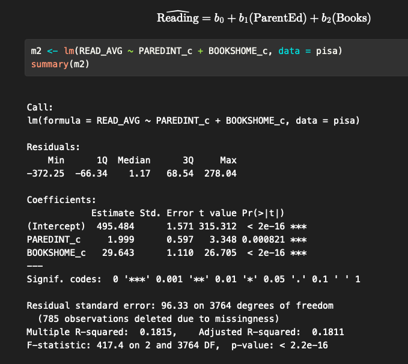
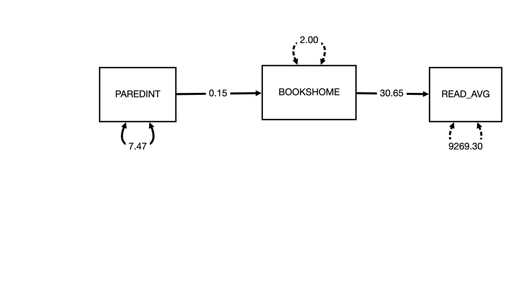
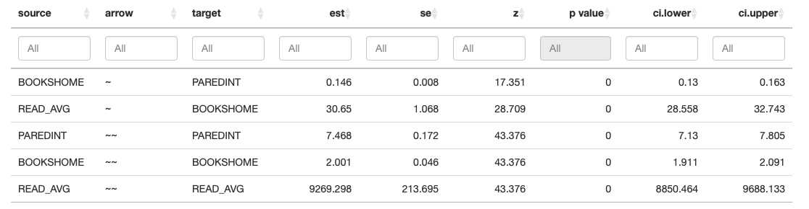
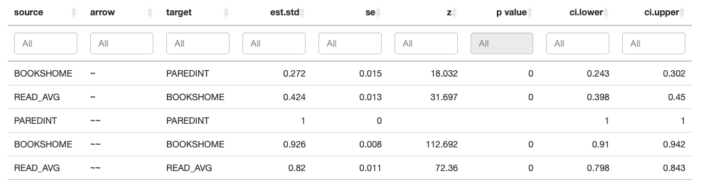
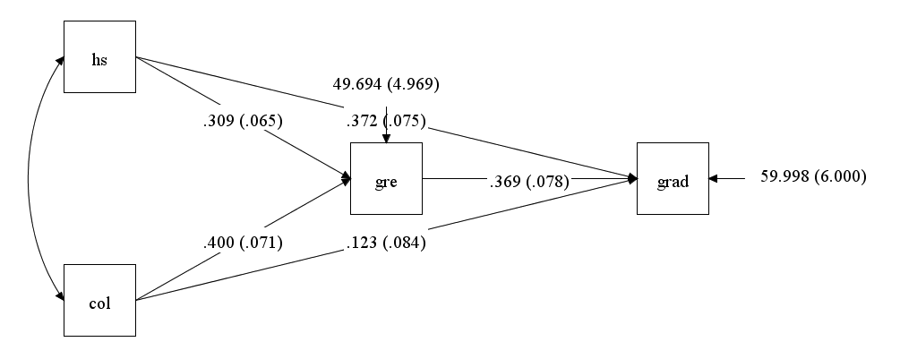
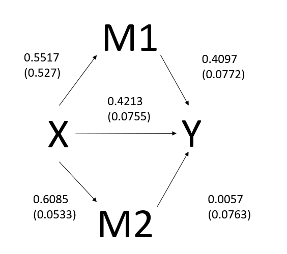
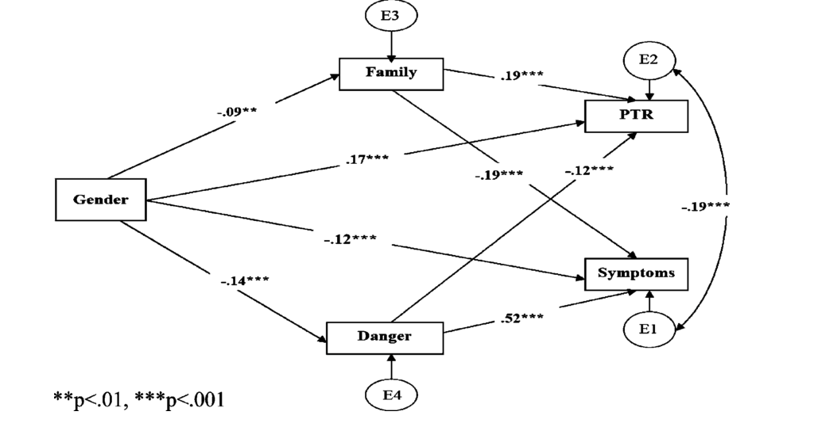
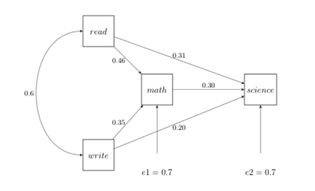

## Agenda

- Review
- Interpretation of path coefficients
  - different model types
  - practice
- Comparing methods
- Lavaan settings

## Review

What are just- under- and over-identification?

- how does identification impact what we model & interpretation?

How do we get the number of degrees of freedom in SEM?
Why/how are DF & identification related?

What do chi2, rmsea, srmsea, cli tell us?

What is H0 in SEM?

## Review Coefficient Interpretation

## Review of Effects

::: {.content-visible when-profile="teacher"}
::: {.fragment}
Main effects
:::
:::

::: {.content-visible when-profile="teacher"}
::: {.fragment}
Interaction effects
:::
:::

::: {.content-visible when-profile="teacher"}
::: {.fragment}
Between vs within group effects
:::
:::

## SEM Effects: Direct

Similar to regression

::: {.content-visible when-profile="teacher"}
::: {.fragment}
- Direct effect: $X \rightarrow Y$
  - Unstandardized: For every 1-unit change in X, Y changes by the path's units.
  - Standardized: For every 1-SD change in X, Y changes by the path's standard deviations
:::
:::

## SEM Effects: Indirect

- Indirect effect: $X \rightarrow M \rightarrow Y$: Multiply path coefficients to get indirect effects
  - Unstandardized: For every 1-unit increase in X, Y changes by the paths' products units.
  - Standardized: For every 1-SD increase in X, Y changes by the paths' products standard deviations.

## SEM Total Effects

- Total effect: Direct + indirect effects

Note that not all models have all types effects

## Model Interpretation

## Interpretation:

$$a \times b = \text{indirect effect}$$

$$0.15 \times 30.65 = 4.597$$

- Unstandardized: For every 1-unit increase in X (parent Ed), Y (reading score) is expected to change by 4.597 units (points) via the pathway through books_home. This is the indirect effect.

## Unstandardized table results

## Unstandardized Var/Disturbance

ParentEd Var: We aren't trying to explain this.

Disturbance in Books:

- 2.001 likert steps$^2$
- typical prediction error for Books $= \sqrt{2.001} = \pm 1.414$ likert steps

Disturbance in Reading Score

- 9269.298 points$^2$
- typical prediction error for Reading Score $= \sqrt{9269.298} = \pm 96.277$ points

## Standardized table results

## Standardized Interpretation: Indirect effect

$$0.272 \times 0.424 = 0.115$$

- Standardized: For every 1-SD increase in X (parent Ed), Y (reading score) is expected to change by 0.115 standard deviations via the pathway through books_home. This is the indirect effect.

## Standardized Var/Disturbance

Variance in parent ed: Always 1

Disturbance: the proportion of variance in this endogenous variable that is NOT explained by its predictors

- Books: 0.926
  - 92.6% of variance in Books remains unexplained by ParentEd

- Reading Ave: 0.82
  - 82% of variance in Reading Ave is unexplained by Books

## Standardized vs Unstandaridized

- Unstandaridized:
  - often easier to interpret raw units (i.e. points)
  - needed for replication

- Standardized:
  - Shows effect size of variables on different scales (i.e. relative importance of parent ed vs reading score)

Typically report both

# Examples

^ Full mediation (indirect-only)

# Partial mediation

## Partial Mediation: Direct

$$\text{hs} \rightarrow \text{grad} = 0.372$$

$$\text{col} \rightarrow \text{grad} = 0.123$$

- For every one-unit increase in hs gpa, grad gpa is expected to increase by 0.372 units. This is a direct effect.
- For every one-unit increase in college gpa, grad gpa is expected to increase by 0.123 units. This is a direct effect.

## Partial Mediation: Indirect

$$\text{hs} \rightarrow \text{gre} \rightarrow \text{grad} = 0.309 \times 0.369 = 0.114$$

- For every one-unit increase in hs gpa, grad gpa is expected to increase by 0.114 units via the pathway through GRE. This is an indirect effect.

$$\text{col} \rightarrow \text{gre} \rightarrow \text{grad} = 0.4 \times 0.369 = 0.147$$

- For every one-unit increase in college gpa, grad gpa is expected to increase by 0.147 units via the pathway through GRE. This is an indirect effect.

## Total effect

Total effect of hs on grad $= 0.372 + 0.114 = 0.486$

- For every one-unit increase in hs GPA, grad GPA is expected to increase by 0.486 units overall — combining both the direct effect (0.372) and the indirect effect through GRE (0.114).

Total effect of col on grad $= 0.123 + 0.147 = 0.270$

- For every one-unit increase in college GPA, grad GPA is expected to increase by 0.270 units overall — combining both the direct effect (0.123) and the indirect effect through GRE (0.147).

## A useful interpretation

Percent of total effect

$$\dfrac{\text{indirect}}{\text{total}} = \%$$

- hs: $0.114 / 0.486 = 23\%$ of hs's total effect on grad GPA is mediated by GRE
- col: $0.147 / 0.270 = 54\%$ of col's total effect on grad GPA is mediated by GRE

## Disturbances

- Typical prediction error for GRE $= \sqrt{49.694} = \pm 7.049$ points
- Typical prediction error for Grad GPA $= \sqrt{59.998} = \pm 7.745$ points

## Real world impact

In pairs: What does this mean for grad school admissions?

# Parallel (multiple) mediators

## Direct Effect

$$X \rightarrow Y = 0.4213$$

- For every one-unit increase in X, Y is expected to increase by 0.4213 units. This is a direct effect.

## Indirect Effect

$$X \rightarrow M_1 \rightarrow Y = 0.5517 \times 0.4097 = 0.2260$$

- For every one-unit increase in X, Y is expected to increase by 0.2260 units via the pathway through M1. This is an indirect effect.

$$X \rightarrow M_2 \rightarrow Y = 0.6085 \times 0.0057 = 0.0035$$

- For every one-unit increase in X, Y is expected to increase by 0.0035 units via the pathway through M2. This is an indirect effect.

## Total Effect

Total effect of X on Y (via M1) $= 0.4213 + 0.226 = 0.6473$

- For every one-unit increase in X, Y is expected to increase by 0.6473 units overall — combining both the direct effect (0.4213) and the indirect effect through M1 (0.226).

Total effect of X on Y (via M2) $= 0.4213 + 0.0035 = 0.4248$

- For every one-unit increase in X, Y is expected to increase by 0.4248 units overall — combining both the direct effect (0.4213) and the indirect effect through M2 (0.0035).

## A useful interpretation

Percent of total effect

$$\dfrac{\text{indirect}}{\text{total}} = \%$$

- via M1: $0.226 / 0.6473 = 35\%$ of X's total effect (through this pathway) is mediated by M1
- via M2: $0.0035 / 0.4248 = 0.8\%$ of X's total effect (through this pathway) is mediated by M2

## Real world impact

Discuss with others from your dept:

1. Reverse-engineer a research question & variables that fit this model
2. Given your variables, how would you interpret the results?

# A more complicated model

## Direct effects

$$\text{Gender} \rightarrow \text{PTR} = 0.17^{***}$$

- For every one-unit increase in Gender, PTR is expected to increase by 0.17 units. This is a direct effect.

$$\text{Gender} \rightarrow \text{Symptoms} = -0.12^{***}$$

- For every one-unit increase in Gender, Symptoms is expected to decrease by 0.12 units. This is a direct effect.

## Indirect effects p1

$$\text{Gender} \rightarrow \text{Family} \rightarrow \text{PTR} = -0.09 \times 0.19 = -0.0171$$

- For every one-unit increase in Gender, PTR is expected to decrease by 0.0171 units via the pathway through Family. This is an indirect effect.

$$\text{Gender} \rightarrow \text{Family} \rightarrow \text{Symptoms} = -0.09 \times -0.19 = 0.0171$$

- For every one-unit increase in Gender, Symptoms is expected to increase by 0.0171 units via the pathway through Family. This is an indirect effect.

## Indirect effects p2

$$\text{Gender} \rightarrow \text{Danger} \rightarrow \text{PTR} = -0.14 \times -0.12 = 0.0168$$

- For every one-unit increase in Gender, PTR is expected to increase by 0.0168 units via the pathway through Danger. This is an indirect effect.

$$\text{Gender} \rightarrow \text{Danger} \rightarrow \text{Symptoms} = -0.14 \times 0.52 = -0.0728$$

- For every one-unit increase in Gender, Symptoms is expected to decrease by 0.0728 units via the pathway through Danger. This is an indirect effect.

## Total effects: gender on ptr

$$\text{direct} + \text{indirect(Family)} + \text{indirect(Danger)} = 0.17 + (-0.0171) + 0.0168 = 0.170$$

- Combining the direct effect and both indirect pathways, a one-unit increase in Gender is associated with a 0.170-unit increase in PTR overall.

## Total effects: Gender on Symptoms

$$\text{direct} + \text{indirect(Family)} + \text{indirect(Danger)} = -0.12 + 0.0171 + (-0.0728) = -0.176$$

- Combining the direct effect and both indirect pathways, a one-unit increase in Gender is associated with a 0.176-unit decrease in Symptoms overall.

## A useful interpretation: PTR

Via Family, to PTR: $-0.0171 / 0.170$
- ≈ −10% of Gender's total effect on PTR is mediated by Family (note the negative sign — this indirect path actually works against the direct effect, partially offsetting it)

Via Danger, to PTR: $0.0168 / 0.170$

- ≈ 10% of Gender's total effect on PTR is mediated by Danger

## A useful interpretation: Symptoms

Via Family, to Symptoms: $0.0171 / -0.176$

- ≈ −10% mediated by Family (again, opposing the direct effect)

Via Danger, to Symptoms: $-0.0728 / -0.176$

- ≈ 41% of Gender's total effect on Symptoms is mediated by Danger.

## Note

Correlated disturbances of PTR & Symptoms

— Still recursive these two variables are not on the same path. There is no direct line connecting them.

## Real world impact

How do you interpret these results?

# Practice

## Practice 1

## Practice 2:

# Discussion

Paper compare your interpretation to the author's interpretation.

# Compare

Look back to XX in Lamaku.

1. What do the regressions models tell us?
2. What does the SEM model tell us that the regression models didn't?

# Rlab: working with Lavaan

- 3 scenarios with description & all required inputs
- Build the models with lavaan syntax (fine to use the gui if needed)
- Determine which arguments you will need to set & what to set them as

Your goal: Get the same outputs I did
Bonus goal: Interpret the model, including fit and the direct, indirect, & total effects

Up next:

- Reporting & Review: prep reading
- MVPA Methods Review 1: Alana, Mia, Alex, Bocar
- In 2 weeks: Mini Project 1

